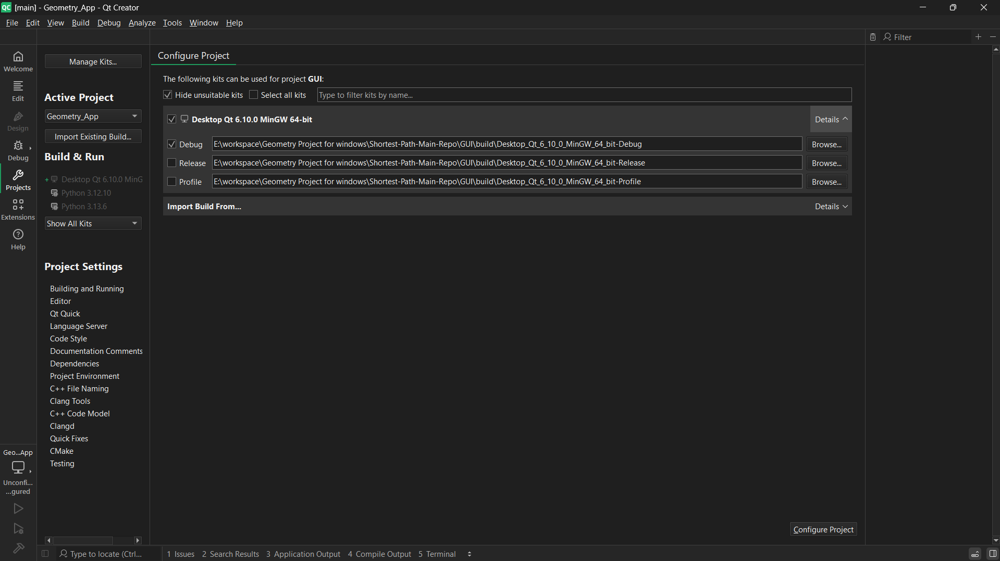

# Shortest Path Algorithm

## how to install 
### Requirments : 
* Pyhton , C++ compiler ,and Git
### Steps:
1. Download QT software https://www.qt.io/download-qt-installer-oss and install it. choose the Desktop development.
2. Clone the Repo : gh repo clone Shotest-Path/Shortest-Path-Main-Repo
3. Open The project in QT app
4. configure the project
    
5. Add the absolute  paths in these files (change the path to your local path) :
    * exportResultFile.cpp => QString appdir = "C:/Users/Hp/OneDrive/Documents/4th 
    * pythonrunner.cpp =>  QString basePath = "C:/Users/Hp/OneDrive/Documents/4th Year/1st Term/Comp 411 Computational Geometry/Project/Visualization";
    * result.cpp =>     QString base_videoPath ="C:/Users/Hp/OneDrive/Documents/4th Year/1st Term/Comp 411 Computational Geometry/Project/Visualization/media/videos";

6. install manim => pip install manim 
7. install MiKTeX => https://miktex.org/download
8. Run